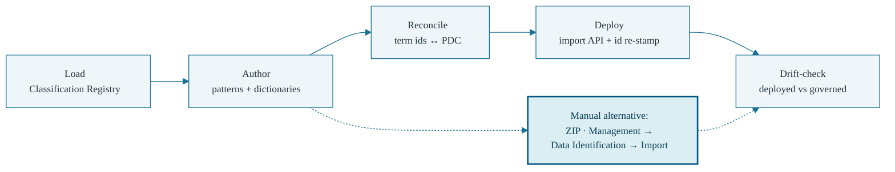

# Pentaho Data Catalog Policy Generator

**Version:** 1.8.1 (`policy_generator/VERSION`) · validated against Pentaho Data Catalog 11.0.0 (public API v3) · [changelog](CHANGELOG.md)

> **1.8.0 — the lifecycle is complete: Deploy + Drift-check ship.** Deploy
> imports the authored set into PDC programmatically over the same endpoint
> PDC 11's own UI zip-upload uses (discovered live: multipart
> `POST /api/importWorkerFiles`), verifies every method landed, and re-stamps
> the reconciled term ids. Drift-check compares every deployed method against
> the Registry — tags, term bindings, regexes, dictionary counts — with a
> clean / drifted / orphaned / missing verdict per method.

A local-first app that **reads the Glossary Generator's Classification
Registry and manages PDC's Data Identification side of the contract**: it
authors import-ready Data Patterns and Dictionaries from the scan's evidence,
each stamping governed tags and binding the governed business term — so what
PDC *identifies* can never quietly diverge from what the glossary *governs*.

It is the second half of a two-app governance pipeline, and it is
**deterministic and offline — no LLM, no database, no network** in the author
stage: every regex and reference list it emits was induced from profiled data
by the [Glossary Generator](https://github.com/jporeilly/PDC-Glossary-Generator)'s
scan and travels inside the Registry.

## Why — the Registry

In PDC the same three facts about a column — its business term, its tags, and
its sensitivity — get decided in more than one place, by hand. The glossary
says one thing; a hand-authored identification rule can silently say another
(`PII` vs `pii`, a stale term binding, an off-vocabulary tag), and the drift
only surfaces in an audit.

The **Classification Registry** (`classification-registry/1`) is the contract
that closes that gap — written by one app, read by this one, mirroring PDC's
own split between the Business Glossary and Data Identification:

1. **[Glossary Generator](https://github.com/jporeilly/PDC-Glossary-Generator)**
   (its own repo) builds the reviewed business glossary and, at export,
   authors the Registry — one row per governed concept carrying the term,
   governed tags (from a controlled allow-list), floor-lifted sensitivity,
   the **detection seeds** (value regexes like `^CSCU-\d{6}$` induced from
   profiled data, plus vetted `curated_seeds` from the domain pack — each
   marked `source: profiled|curated`), the physical source columns, PK/FK
   facts, and the full governed tag vocabulary with its audit provenance.
2. **Policy Generator** (this repo) **reads that Registry** and owns the
   Data Identification lifecycle:

   | Stage                 | What it does                                                                                                                                                                                                  | Status            |
   | --------------------- | ------------------------------------------------------------------------------------------------------------------------------------------------------------------------------------------------------------- | ----------------- |
   | **Author**      | one DataPattern envelope per regex seed, one Dictionary envelope (+ Term-header values CSV) per reference-list seed — the exact format PDC's own Export produces, each applying the Registry's governed tags   | **working** |
   | **Reconcile**   | verify each concept's minted `term_id` against a live PDC (Keycloak-first auth; the Glossary app's proven three-path term lookup) and bind authoring to the ids                                              | **working** |
   | **Deploy**      | import the methods programmatically over PDC's import API (multipart `/api/importWorkerFiles`, discovered live — the same path the UI's zip upload takes), verify each landed, re-stamp reconciled term ids, and optionally trigger a `DATA_IDENTIFICATION` bulk job scoped to chosen entities | **working** |
   | **Drift-check** | compare every deployed method against the Registry's governed facts — off-vocabulary or missing tags, broken term bindings (name + id), edited regexes/signatures, changed dictionary row counts, disabled methods — verdict per method: clean / drifted / orphaned / missing              | **working** |

```mermaid
%%{init: {'theme':'base','themeVariables':{'primaryColor':'#EEF6FA','primaryBorderColor':'#1C7293','primaryTextColor':'#22333B','lineColor':'#1C7293','fontFamily':'Segoe UI, sans-serif','fontSize':'13px','clusterBkg':'#F7FBFD','clusterBorder':'#CFE3EC','edgeLabelBackground':'#FFFFFF'},'flowchart':{'curve':'basis','nodeSpacing':30,'rankSpacing':45}}}%%
flowchart TB
    PACK[/"Domain pack<br/><small>vocabulary &middot; curated_seeds</small>"/]
    subgraph EST["Data estate &mdash; one vertical"]
        direction LR
        DB[("cscu_core<br/>PostgreSQL")] ~~~ DOC[("cscu-documents<br/>MinIO")]
    end
    subgraph GG["Glossary Generator &mdash; :5000"]
        direction LR
        SCAN["&#9312; Scan +<br/>Profile"] --> REV["&#9313; Steward review<br/>+ AI agents"] --> GOV["&#9314; Govern"] --> GEN["&#9315; Generate"]
    end
    REG[["Classification Registry<br/><small>one governed row per concept:<br/>term &middot; tags &middot; sensitivity &middot; seeds &middot; sources</small>"]]
    subgraph PG["Policy Generator &mdash; :5001"]
        direction LR
        AUT["&#9312; Author"] --> RECON["&#9313; Reconcile"] --> DEPL["&#9314; Deploy"] --> DRIFT["&#9315; Drift-check"]
    end
    PDC[("Pentaho Data Catalog 11 &mdash; the governed estate")]

    PACK --> GG
    EST --> GG
    GG == "&#9315; writes<br/>the contract" ==> REG
    REG == "&#9312; reads<br/>the contract" ==> PG
    GG -- "&#9314; glossary JSONL + Apply<br/><small>mapping-based binding</small>" --> PDC
    PG -- "&#9314; custom patterns + dictionaries<br/><small>imported over the import API</small>" --> PDC
    PG <-. "&#9313; minted<br/>term ids" .-> PDC
    PG -- "&#9315; deployed methods vs<br/>the Registry's governed facts" --> PDC

    style GG fill:#EFF7FA,stroke:#9CC4D4
    style PG fill:#FDFBF2,stroke:#DFCE8F
    style EST fill:#F7FBFD,stroke:#CFE3EC
    classDef contract fill:#0A3D52,color:#fff,stroke:#0A3D52,stroke-width:2px
    classDef pdc fill:#DBEEF3,stroke:#065A82,color:#0A3D52,stroke-width:2px
    classDef pack fill:#FFF7E0,stroke:#C9A227,color:#7A5A00
    classDef stage fill:#FFFFFF,stroke:#1C7293,color:#0A3D52
    class REG contract
    class PDC pdc
    class PACK pack
    class SCAN,REV,GOV,GEN,AUT,RECON,DEPL,DRIFT stage
```



Because both apps draw from the same Registry row, the glossary term, the
tags a method stamps, and the sensitivity can never quietly diverge — that is
the point of the contract. The schema is documented field-by-field in
[docs/CONTRACT.md](docs/CONTRACT.md).

### The three mechanisms — how every governed term is applied and checked


## What it does

- **Load** — drag-drop a Registry into the web UI (or give a path), and read
  the contract summary: concepts, detection seeds, resolved term ids,
  governed tags, off-vocabulary warnings. When this repo is cloned beside or
  inside the Glossary checkout (the lab VM's `~/PDC-Demo` layout), the app
  **auto-discovers** `glossary_generator/registries/registry.*.json` and
  lists what it found — a single match loads itself.
- **Author** — preview the method manifest, inspect any rule (governed tag
  chips, column hint, the **full JSON exactly as PDC imports it**, and a
  live tester for the regex or dictionary values), then download the set as
  one zip: `patterns-import.zip`, `dictionaries-import.zip` (values CSVs
  inside), `INDEX.csv` — the exact layout PDC's **Management → Data
  Identification → Import** accepts (and the Deploy stage uploads).
  Tags are re-filtered against the Registry's embedded allow-list at
  authoring time; off-vocabulary tags are refused, never imported.
- **Explain, don't confuse** — concepts without seeds are grouped into
  color-coded buckets by the mechanism that governs them: *seedable*
  (amber — add a curated seed), *applied by mapping* (teal — the Glossary
  app's Apply step), *business-rule territory* (purple), *table/folder
  level* (gray). An import checklist tracks the manual PDC steps after each
  download and drives the workflow stepper.
- **Learn as you go** — the UI teaches the way the Glossary app does:
  expandable **"Under the hood"** panels explain every concept (what each
  summary number means, how a seed becomes a method field-by-field) and show
  the exact calls each step runs — this app's own API, the manual PDC import
  path, and the deploy-stage import calls. Each page opens with a collapsed
  **explainer card** in the same pattern: the Registry contract with the
  two-app handoff graphic (Load), the skipped-groups legend (Author), what
  Deploy actually does (Deploy), and how to read the verdicts (Drift). The
  sidebar footer shows the live **PDC session status** — a green dot plus
  the signed-in user once connected.
- **Reconcile** — connect to PDC (token held in memory only), look every
  concept's term up with the Glossary app's proven three-path lookup, and see
  verified / resolved / mismatch / missing per term. One click stamps the
  PDC ids into the loaded Registry so re-authored rules bind **by id**;
  export keeps a reconciled copy.
- **Deploy** — import the authored set into PDC programmatically over the
  same endpoint the UI's zip upload uses (multipart
  `POST /api/importWorkerFiles`, discovered live), wait for the import
  workers, verify every method landed, and re-stamp the reconciled term ids
  into each method's term binding (PDC's importer rewrites ids it cannot
  resolve). Dry-run shows the create/update plan first; an optional
  `DATA_IDENTIFICATION` bulk job can be triggered scoped to chosen entity
  ids. Everything imported carries the authoring prefix, so the scoped
  retire can always clean it up.
- **Drift-check** — read every deployed method under the prefix and compare
  it against the Registry: governed tags vs the allow-list, term binding
  (name **and** id), content regex + profile signature vs the seeds,
  dictionary row counts. Verdict per method — clean / drifted / orphaned /
  missing — rendered reconcile-style with the exact findings.
- **Same engine on the CLI** — `python -m policy_generator info|author`,
  zero dependencies, for scripted or headless use.

## Repository layout

```text
policy_generator/       the app: engine (registry.py, author.py, pdc.py,
                        drift.py), CLI, FastAPI web layer (api.py), launchers,
                        VERSION
frontend/               React (Vite) UI — served by the API from frontend/dist
tests/                  pytest suite: engine invariants, API flows (PDC mocked),
                        docs-consistency enforcement
docs/
  CONTRACT.md           the classification-registry/1 schema, field by field
  INSTALL.md            install & lab-setup guide (markdown master)
  lab-setup.docx        the same guide in the course design, generated
  tools/                builds docs/lab-setup.docx from INSTALL.md
CHANGELOG.md            release history
install-pdc-demo.sh     install/update the app inside the lab VM's ~/PDC-Demo
                        checkout + pull the selected vertical's courseware
                        from PDC-Scenarios
```

## Install & run

Once the app is up, one pass through it is short — five stages, all working;
the manual UI import stays available as the reviewed-zip alternative to
Deploy:



**Requirements:** Python 3.9+. PDC is reached only when *you* import and run
the methods — the app itself stays offline. **No LLM.**

On the **Windows 11 host** (the standard topology — apps on the host, lab +
PDC on the VM), the whole suite is one bootstrap into `C:\PDC-Demo`
(PDC-Scenarios repo; it also builds this app's React UI):

```powershell
iex "& { $(irm https://raw.githubusercontent.com/jporeilly/PDC-Scenarios/main/install-pdc-demo.ps1) } CSCU"
cd C:\PDC-Demo\policy_generator; .\run.ps1     # → http://127.0.0.1:5001
```

On the **lab VM**, the same bootstrap is `install-pdc-demo.sh`, and this
repo's own `install-pdc-demo.sh` updates just this app + vertical. The full
guide is [docs/INSTALL.md](docs/INSTALL.md) (also as
[docs/lab-setup.docx](docs/lab-setup.docx)). The manual short version:

```bash
git clone https://github.com/jporeilly/PDC-Policy-Generator.git
cd PDC-Policy-Generator/policy_generator
.\run.ps1                        # Windows (or double-click run.bat)
./run.sh                         # Linux/macOS → http://127.0.0.1:5001
```

(In a bootstrapped PDC-Demo the app sits flat at `PDC-Demo/policy_generator`
— same commands from there.)

The launcher manages a local `.venv` (fastapi + uvicorn — the engine itself is
stdlib-only) and defaults to **port 5001** so the Glossary Generator (5000) runs
alongside. The React UI is served from `frontend/dist`; build it once with
`cd frontend && npm install && npm run build` (Node 18+). **Interactive API
docs live at `/docs`** — every endpoint, typed and try-able.

**CLI** (no dependencies at all):

```bash
python -m policy_generator info                    # newest auto-discovered Registry
python -m policy_generator author -o out/ --prefix CSCU
python -m policy_generator author path/to/registry.<id>.json --zip methods.zip
```

**Tests** (offline; PDC calls are mocked):

```bash
pip install -e ".[dev]" && pytest
```

## Courseware

This app's workshops live in the **[PDC-Scenarios](https://github.com/jporeilly/PDC-Scenarios)**
repo, separated per app within each vertical: `courseware/<ID>/Policy/`
(beside `Platform/` and `Glossary/`). The CSCU set's
`Workshop-Policy-Generator-CSCU.md` picks up where the Glossary Generator's
CSCU app workshop ends — at the Registry hand-off — and walks Registry →
`info` → `author` → PDC import → run Data Identification → verify, with
checkpoints. `select-vertical.sh <ID>` there pulls just one vertical;
this repo's `install-pdc-demo.sh <ID>` does it for you on the VM.

## Documentation

| Document                                                   | What it covers                                                                                                     |
| ---------------------------------------------------------- | ------------------------------------------------------------------------------------------------------------------ |
| [docs/INSTALL.md](docs/INSTALL.md)                          | Install & lab setup: prerequisites, cloning (workstation or`~/PDC-Demo`), web UI, CLI, tests, troubleshooting |
| [docs/lab-setup.docx](docs/lab-setup.docx)                  | The same guide in the course design (generated from INSTALL.md)                                                    |
| [docs/CONTRACT.md](docs/CONTRACT.md)                        | The`classification-registry/1` schema and the guarantees both apps share                                         |
| [CHANGELOG.md](CHANGELOG.md) · [VERSION.md](VERSION.md)     | Release history (the runtime version lives in`policy_generator/VERSION`)                                         |
| [PDC-Scenarios](https://github.com/jporeilly/PDC-Scenarios) | Every vertical's data kit, domain pack and courseware — this app's workshops under`courseware/<ID>/Policy/`     |

The shared lab (PDC VM, demo PostgreSQL + MinIO, scenario loads) is owned by
the Glossary repo — its `data_sources/lab/lab-setup.docx` (Parts A–I) is the
authoritative build guide.

## Status

All five stages work end-to-end. **Author** runs from a real Registry over
the web UI or the CLI; **reconcile** (verify/bind term ids, scoped retire),
**deploy** (programmatic import over PDC's own import endpoint, verified
live against PDC 11.0.0, with post-import term-id re-stamping) and
**drift-check** (per-method clean / drifted / orphaned / missing verdicts)
run over the web UI against a live PDC. Everything is covered by the offline
pytest suite (PDC mocked). Remaining roadmap: writing the deployed method
binding back into the Registry's reserved `method` field.

*All scenario data referenced here (CSCU et al.) is fictional and generated
for training.*
