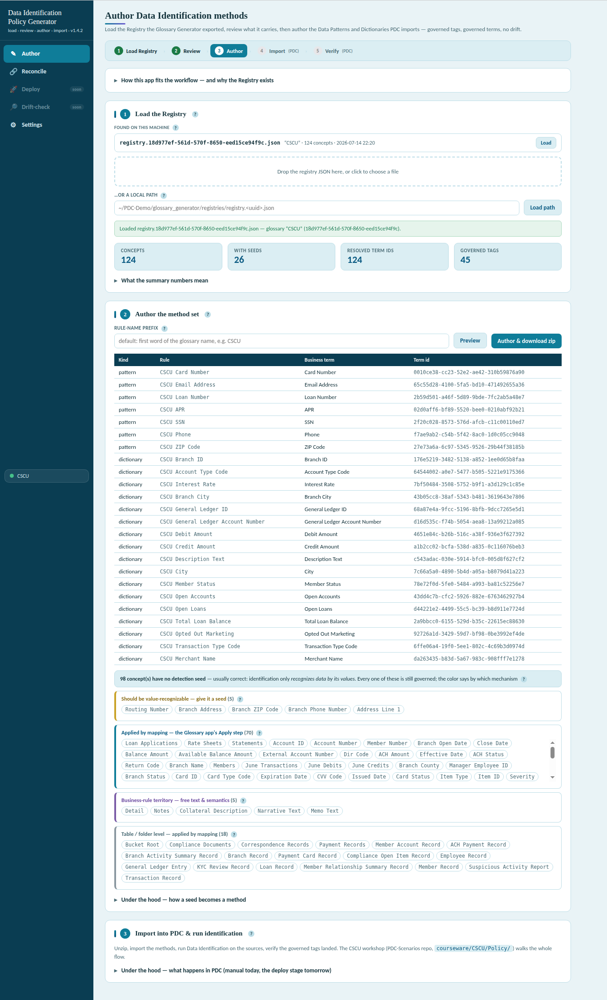
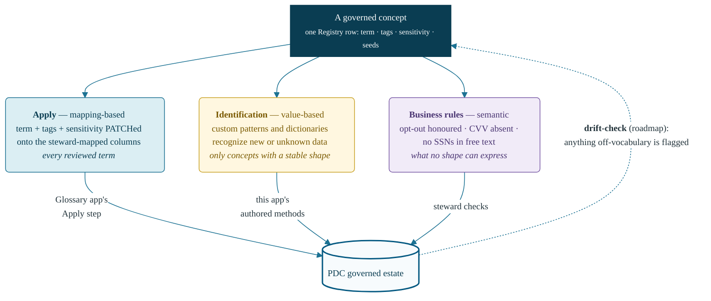

# Pentaho Data Catalog Policy Generator

**Version:** 1.5.1 (`policy_generator/VERSION`) · validated against Pentaho Data Catalog 11.0.0 (public API v3) · [changelog](docs/CHANGELOG.md)

A local-first app that **reads the Glossary Generator's Classification
Registry and manages PDC's Data Identification side of the contract**: it
authors import-ready Data Patterns and Dictionaries from the scan's evidence,
each stamping governed tags and binding the governed business term — so what
PDC *identifies* can never quietly diverge from what the glossary *governs*.

It is the second half of a two-app governance pipeline, and it is
**deterministic and offline — no LLM, no database, no network** in the author
stage: every regex and reference list it emits was induced from profiled data
by the [Glossary Generator](https://github.com/jporeilly/PDC-Glossary-Generator)'s
scan and travels inside the Registry.



## Why — the Registry

In PDC the same three facts about a column — its business term, its tags, and
its sensitivity — get decided in more than one place, by hand. The glossary
says one thing; a hand-authored identification rule can silently say another
(`PII` vs `pii`, a stale term binding, an off-vocabulary tag), and the drift
only surfaces in an audit.

The **Classification Registry** (`classification-registry/1`) is the contract
that closes that gap — written by one app, read by this one, mirroring PDC's
own split between the Business Glossary and Data Identification:

1. **[Glossary Generator](https://github.com/jporeilly/PDC-Glossary-Generator)**
   (its own repo) builds the reviewed business glossary and, at export,
   authors the Registry — one row per governed concept carrying the term,
   governed tags (from a controlled allow-list), floor-lifted sensitivity,
   the **detection seeds** (value regexes like `^CSCU-\d{6}$` induced from
   profiled data, plus vetted `curated_seeds` from the domain pack — each
   marked `source: profiled|curated`), the physical source columns, PK/FK
   facts, and the full governed tag vocabulary with its audit provenance.
2. **Policy Generator** (this repo) **reads that Registry** and owns the
   Data Identification lifecycle:

   | Stage                 | What it does                                                                                                                                                                                                  | Status            |
   | --------------------- | ------------------------------------------------------------------------------------------------------------------------------------------------------------------------------------------------------------- | ----------------- |
   | **Author**      | one DataPattern envelope per regex seed, one Dictionary envelope (+ Term-header values CSV) per reference-list seed — the exact format PDC's own Export produces, each applying the Registry's governed tags   | **working** |
   | **Reconcile**   | verify each concept's minted `term_id` against a live PDC (Keycloak-first auth; the Glossary app's proven three-path term lookup) and bind authoring to the ids                                              | **working** |
   | **Deploy**      | import the methods over the public API (v3) and trigger `DATA_IDENTIFICATION` bulk jobs scoped to the right entities                                                                                         | next              |
   | **Drift-check** | compare deployed methods' Assign-Tags and PDC's live tag facet against the Registry's governed vocabulary — flag methods stamping off-vocabulary tags, governed tags nothing emits, and broken term bindings | next              |

```mermaid
%%{init: {'theme':'base','themeVariables':{'primaryColor':'#EEF6FA','primaryBorderColor':'#1C7293','primaryTextColor':'#22333B','lineColor':'#1C7293','fontFamily':'Segoe UI, sans-serif','fontSize':'13px','clusterBkg':'#F7FBFD','clusterBorder':'#CFE3EC','edgeLabelBackground':'#FFFFFF'},'flowchart':{'curve':'basis','nodeSpacing':30,'rankSpacing':45}}}%%
flowchart TB
    PACK[/"Domain pack<br/><small>vocabulary &middot; curated_seeds</small>"/]
    subgraph EST["Data estate &mdash; one vertical"]
        direction LR
        DB[("cscu_core<br/>PostgreSQL")] ~~~ DOC[("cscu-documents<br/>MinIO")]
    end
    subgraph GG["Glossary Generator &mdash; :5000"]
        direction LR
        SCAN["&#9312; Scan +<br/>Profile"] --> REV["&#9313; Steward review<br/>+ AI agents"] --> GOV["&#9314; Govern"] --> GEN["&#9315; Generate"]
    end
    REG[["Classification Registry<br/><small>one governed row per concept:<br/>term &middot; tags &middot; sensitivity &middot; seeds &middot; sources</small>"]]
    subgraph PG["Policy Generator &mdash; :5001"]
        direction LR
        AUT["&#9312; Author"] --> RECON["&#9313; Reconcile"] --> DEPL["&#9314; Deploy<br/><small>roadmap</small>"] --> DRIFT["&#9315; Drift-check<br/><small>roadmap</small>"]
    end
    PDC[("Pentaho Data Catalog 11 &mdash; the governed estate")]

    PACK --> GG
    EST --> GG
    GG == "&#9315; writes<br/>the contract" ==> REG
    REG == "&#9312; reads<br/>the contract" ==> PG
    GG -- "&#9314; glossary JSONL + Apply<br/><small>mapping-based binding</small>" --> PDC
    PG -- "&#9312; custom patterns + dictionaries<br/><small>value-based recognition</small>" --> PDC
    PG <-. "&#9313; minted<br/>term ids" .-> PDC
    PG -. "&#9315; live tag facet vs<br/>governed vocabulary" .-> PDC

    style GG fill:#EFF7FA,stroke:#9CC4D4
    style PG fill:#FDFBF2,stroke:#DFCE8F
    style EST fill:#F7FBFD,stroke:#CFE3EC
    classDef contract fill:#0A3D52,color:#fff,stroke:#0A3D52,stroke-width:2px
    classDef pdc fill:#DBEEF3,stroke:#065A82,color:#0A3D52,stroke-width:2px
    classDef roadmap fill:#F4F6F7,stroke:#9AA5AB,color:#5B6770,stroke-dasharray:4 3
    classDef pack fill:#FFF7E0,stroke:#C9A227,color:#7A5A00
    classDef stage fill:#FFFFFF,stroke:#1C7293,color:#0A3D52
    class REG contract
    class PDC pdc
    class DEPL,DRIFT roadmap
    class PACK pack
    class SCAN,REV,GOV,GEN,AUT,RECON stage
```



Because both apps draw from the same Registry row, the glossary term, the
tags a method stamps, and the sensitivity can never quietly diverge — that is
the point of the contract. The schema is documented field-by-field in
[docs/CONTRACT.md](docs/CONTRACT.md).

### The three mechanisms — how every governed term is applied and checked



## What it does

- **Load** — drag-drop a Registry into the web UI (or give a path), and read
  the contract summary: concepts, detection seeds, resolved term ids,
  governed tags, off-vocabulary warnings. When this repo is cloned beside or
  inside the Glossary checkout (the lab VM's `~/PDC-Demo` layout), the app
  **auto-discovers** `glossary_generator/registries/registry.*.json` and
  lists what it found — a single match loads itself.
- **Author** — preview the method manifest, inspect any rule (governed tag
  chips, column hint, the **full JSON exactly as PDC imports it**, and a
  live tester for the regex or dictionary values), then download the set as
  one zip: `Patterns/`, `Dictionaries/` (+ values CSVs), `INDEX.csv` — the
  exact shapes PDC's **Management → Data Identification → Import** accepts.
  Tags are re-filtered against the Registry's embedded allow-list at
  authoring time; off-vocabulary tags are refused, never imported.
- **Explain, don't confuse** — concepts without seeds are grouped into
  color-coded buckets by the mechanism that governs them: *seedable*
  (amber — add a curated seed), *applied by mapping* (teal — the Glossary
  app's Apply step), *business-rule territory* (purple), *table/folder
  level* (gray). An import checklist tracks the manual PDC steps after each
  download and drives the workflow stepper.
- **Learn as you go** — the UI teaches the way the Glossary app does:
  expandable **"Under the hood"** panels explain every concept (what each
  summary number means, how a seed becomes a method field-by-field) and show
  the exact calls each step runs — this app's own API, the manual PDC import
  path, and the deploy-stage public-API calls, badged *roadmap* until they
  ship.
- **Reconcile** — connect to PDC (token held in memory only), look every
  concept's term up with the Glossary app's proven three-path lookup, and see
  verified / resolved / mismatch / missing per term. One click stamps the
  PDC ids into the loaded Registry so re-authored rules bind **by id**;
  export keeps a reconciled copy.
- **Same engine on the CLI** — `python -m policy_generator info|author`,
  zero dependencies, for scripted or headless use.

## Repository layout

```text
policy_generator/       the app: engine (registry.py, author.py), CLI,
                        web UI (app.py + templates/), launchers, VERSION
docs/
  CONTRACT.md           the classification-registry/1 schema, field by field
  CHANGELOG.md          release history
  INSTALL.md            install & lab-setup guide (markdown master)
  lab-setup.docx        the same guide in the course design, generated
  tools/                builds docs/lab-setup.docx from INSTALL.md
install-pdc-demo.sh     install/update the app inside the lab VM's ~/PDC-Demo
                        checkout + pull the selected vertical's courseware
                        from PDC-Scenarios (clone or pull + selftest)
```

## Install & run

**Requirements:** Python 3.9+. PDC is reached only when *you* import and run
the methods — the app itself stays offline. **No LLM.**

On the lab VM, the **whole lab** (both apps + the selected vertical) is one
bootstrap — PDC-Scenarios' `install-pdc-demo.sh` — and this repo's own
`install-pdc-demo.sh` updates just this app + vertical. The full guide is
[docs/INSTALL.md](docs/INSTALL.md) (also as
[docs/lab-setup.docx](docs/lab-setup.docx)). The short version:

```bash
git clone https://github.com/jporeilly/PDC-Policy-Generator.git
cd PDC-Policy-Generator/policy_generator
./run.sh                         # Linux/macOS → http://127.0.0.1:5001
.\run.ps1                        # Windows (or double-click run.bat)
```

(In a bootstrapped PDC-Demo the app sits flat at `PDC-Demo/policy_generator`
— same commands from there.)

The launcher manages a local `.venv` (Flask is the only dependency) and
defaults to **port 5001** so the Glossary Generator (5000) runs alongside.

**CLI** (no dependencies at all):

```bash
python -m policy_generator info                    # newest auto-discovered Registry
python -m policy_generator author -o out/ --prefix CSCU
python -m policy_generator author path/to/registry.<id>.json --zip methods.zip
python -m policy_generator.selftest                # offline self-test (20 checks)
```

## Courseware

This app's workshops live in the **[PDC-Scenarios](https://github.com/jporeilly/PDC-Scenarios)**
repo, separated per app within each vertical: `courseware/<ID>/Policy/`
(beside `Platform/` and `Glossary/`). The CSCU set's
`Workshop-Policy-Generator-CSCU.md` picks up where the Glossary Generator's
CSCU app workshop ends — at the Registry hand-off — and walks Registry →
`info` → `author` → PDC import → run Data Identification → verify, with
checkpoints. `select-vertical.sh <ID>` there pulls just one vertical;
this repo's `install-pdc-demo.sh <ID>` does it for you on the VM.

## Documentation

| Document                                                   | What it covers                                                                                                     |
| ---------------------------------------------------------- | ------------------------------------------------------------------------------------------------------------------ |
| [docs/INSTALL.md](docs/INSTALL.md)                          | Install & lab setup: prerequisites, cloning (workstation or`~/PDC-Demo`), web UI, CLI, selftest, troubleshooting |
| [docs/lab-setup.docx](docs/lab-setup.docx)                  | The same guide in the course design (generated from INSTALL.md)                                                    |
| [docs/CONTRACT.md](docs/CONTRACT.md)                        | The`classification-registry/1` schema and the guarantees both apps share                                         |
| [docs/CHANGELOG.md](docs/CHANGELOG.md)                      | Release history (the app version lives in`policy_generator/VERSION`)                                             |
| [PDC-Scenarios](https://github.com/jporeilly/PDC-Scenarios) | Every vertical's data kit, domain pack and courseware — this app's workshops under`courseware/<ID>/Policy/`     |

The shared lab (PDC VM, demo PostgreSQL + MinIO, scenario loads) is owned by
the Glossary repo — its `data_sources/lab/lab-setup.docx` (Parts A–I) is the
authoritative build guide.

## Status

The **author** stage works end-to-end from a real Registry — over the web UI
or the CLI — and is covered by the offline selftest. Reconcile, deploy and
drift-check are the roadmap, in that order — drift needs deployed methods to
check, which needs reconcile-and-deploy first.

*All scenario data referenced here (CSCU et al.) is fictional and generated
for training.*
