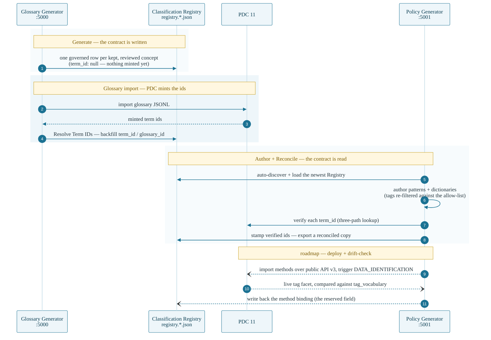
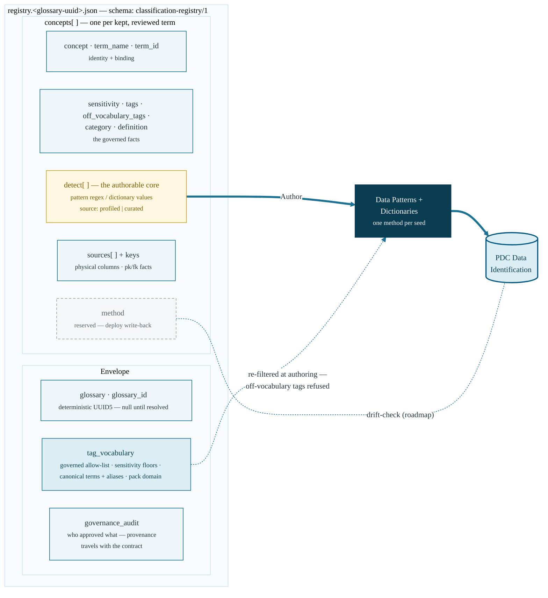

# The Classification Registry contract (`classification-registry/1`)

Written by the **Glossary Generator** at Generate time
(`glossary_generator/registries/registry.<glossary-uuid>.json`), read by
**this app**. One file per glossary; regenerated on every export (export
time = latest reviewed state). The Glossary app's **Resolve Term IDs** step
backfills `term_id` / `glossary_id` after the glossary is imported into PDC.

The whole lifecycle of one Registry file — who writes, who reads, and when
the ids arrive:

## Envelope

| Field | Meaning |
| --- | --- |
| `schema` | always `classification-registry/1` |
| `glossary` / `glossary_id` | the glossary name and its deterministic UUID5 (null until resolved) |
| `concepts[]` | one entry per kept, reviewed term — see below |
| `tag_vocabulary` | the governed tag allow-list (lower-case), per-tag sensitivity floors, canonical terms with aliases, the pack domain — the drift boundary both apps share |
| `governance_audit` | compact who-approved-what summary from the app's audit trail (provenance travels with the contract) |

## Concept fields

| Field | Meaning | Used by this app for |
| --- | --- | --- |
| `concept` | stable slug of the term | filenames, matching |
| `term_name` | the governed business term | `assignBusinessTerm`, name binding |
| `term_id` | PDC's minted term id (null until glossary import + Resolve) | id binding (reconcile) |
| `sensitivity` | LOW / MEDIUM / HIGH, floor-lifted | drift checks vs tag floors |
| `tags` | governed, lower-case | rule `applyTags` (re-filtered against `tag_vocabulary.allow_list` at authoring) |
| `off_vocabulary_tags` | tags that escaped the allow-list | authoring refuses them; drift flags them |
| `category` | glossary category | rule `category` grouping |
| `definition` | the steward's reviewed definition | context in review output |
| `detect[]` | detection seeds: `{type: "pattern", regex, signature?, source}` or `{type: "dictionary", values[], source}`. `source: "profiled"` = induced from scanned data; `source: "curated"` = a vetted canonical shape or reference list from the domain pack's `curated_seeds` (profiled wins over curated for the same seed type) | **the authorable core** — one method per seed |
| `sources[]` | the physical columns/files the term maps to | column-name regex hints |
| `keys` | per-source `{pk, fk, ref}` facts | relationship context (identity vs join) |
| `method` | reserved: the deployed method binding this app writes back | reconcile/drift |

## The contract at a glance

## Guarantees the contract gives

- **Tags cannot drift**: rules only ever stamp tags from
  `tag_vocabulary.allow_list` (checked again at authoring), and the same
  allow-list drives the Glossary app's tagging — one vocabulary, two apps.
- **Deterministic ids**: `glossary_id` and term ids are UUID5s derived from
  names, the same ids the glossary JSONL carries — so bindings survive
  re-exports.
- **Evidence-grounded methods**: every regex/dictionary was induced from
  profiled data or comes from the pack's vetted `curated_seeds` (`source`
  says which), never guessed from names — the custom-only program's
  auditable replacement for PDC's built-ins.
