# Policy Generator — install & lab setup

*App 1.7.x · targets Pentaho Data Catalog 11.0.0 (public API v3)*

**Primary role:** Data Steward / Data Developer / IT Administrator
**Estimated time:** 15–20 minutes (app only — the shared lab is a separate, one-time build)

---

## Overview

This guide stands up the **Policy Generator** — the app that reads the
Glossary Generator's **Classification Registry** and authors PDC's Data
Identification methods (Data Patterns + Dictionaries) from it. The app is
**local-first, deterministic and offline**: no LLM, no database, no network
calls in the author stage. All it needs is Python and a Registry file.

### What you will have at the end

- The web UI running at `http://127.0.0.1:5001` (the Glossary Generator keeps
  port 5000 — both run side by side).
- The CLI (`python -m policy_generator`) working with zero dependencies.
- The offline pytest suite passing (20 tests, no PDC, no network).
- A Registry loaded and a method set authored, ready for
  **Management → Data Identification → Import** in PDC.

## Prerequisites

| What | Why | Where it comes from |
| --- | --- | --- |
| **Python 3.9+** on the host | runs the app (the launchers check this) | python.org — on Windows tick *Add to PATH* |
| **The shared lab + a vertical** (e.g. CSCU) | the data estate PDC scans and identifies | the [PDC-Scenarios](https://github.com/jporeilly/PDC-Scenarios) repo — `select-vertical.sh <ID>` pulls it; its `data_sources/lab/lab-setup.docx` (Parts A–I) is the one-time VM/lab build guide |
| **A Classification Registry** | the only input the author stage needs | written by the Glossary Generator at Generate time: `glossary_generator/registries/registry.<glossary-uuid>.json` |
| **PDC 11.0.0 reachable over HTTPS** | to import the methods and run Data Identification | the lab VM (e.g. `https://pentaho.io` on `192.168.1.200`) |
| A PDC user allowed to import under **Management → Data Identification** | the import step | Workshop 0 (Preflight) of the scenario's courseware |

**No LLM, no Ollama, no GPU** — the evidence this app authors from (induced
regexes, profiled value lists) was already gathered by the Glossary app's
scan and travels inside the Registry.

## The standard topology — where everything runs

| Where | What runs there | One-command install/update |
| --- | --- | --- |
| **Windows host** (bare metal) | both apps — the Glossary Generator (:5000, Ollama here) and this app (:5001) — plus the vertical's courseware and domain pack, installed to **`C:\PDC-Demo`** (kept separate from dev checkouts) | PowerShell: `iex "& { $(irm https://raw.githubusercontent.com/jporeilly/PDC-Scenarios/main/install-pdc-demo.ps1) } CSCU"` |
| **Ubuntu VM** (192.168.1.200) | PDC 11.0.0 itself + the demo lab (Postgres 5433, MinIO) | `curl -fsSL https://raw.githubusercontent.com/jporeilly/PDC-Scenarios/main/install-pdc-demo.sh \| bash -s -- CSCU` then `cd ~/PDC-Demo/PDC-Scenarios && make scenario ID=CSCU` |

```mermaid
%%{init: {'theme':'base','themeVariables':{'primaryColor':'#EEF6FA','primaryBorderColor':'#1C7293','primaryTextColor':'#22333B','lineColor':'#1C7293','fontFamily':'Segoe UI, sans-serif','fontSize':'13px','clusterBkg':'#F7FBFD','clusterBorder':'#CFE3EC','edgeLabelBackground':'#FFFFFF'},'flowchart':{'curve':'basis','nodeSpacing':35,'rankSpacing':70}}}%%
flowchart LR
    subgraph WIN["Windows host &mdash; bare metal &middot; C:&#92;PDC-Demo"]
        direction TB
        GGU["Glossary Generator &mdash; :5000<br/><small>+ Ollama (LLM stays on the host)</small>"]
        PGU["Policy Generator &mdash; :5001<br/><small>no LLM &middot; no network in Author</small>"]
        KIT["vertical courseware<br/>+ domain pack<br/><small>from PDC-Scenarios</small>"]
    end
    subgraph VM["Ubuntu 24.04 VM &mdash; 192.168.1.200 &middot; pentaho.io"]
        direction TB
        PDC[("PDC 11.0.0<br/><small>https://pentaho.io</small>")]
        subgraph LAB["demo lab &mdash; Docker"]
            direction TB
            PGDB[("demo-postgres<br/>:5433")]
            MINIO[("demo-minio<br/>:9000 / :9001")]
        end
    end
    GGU == "Classification Registry" ==> PGU
    GGU -- "glossary JSONL &middot; Apply &middot;<br/>Resolve Term IDs &mdash; HTTPS" --> PDC
    PGU -- "method import (UI) &middot;<br/>reconcile (public API v3)" --> PDC
    PDC -- "scan &middot; profile &middot;<br/>data identification" --> PGDB
    PDC -- "Scan Files" --> MINIO
    ALT["alt: either app can run on the VM instead &mdash;<br/>bash run.sh --host 0.0.0.0 &rarr; http://192.168.1.200:500x"]
    ALT -.- VM

    classDef contract fill:#0A3D52,color:#fff,stroke:#0A3D52
    classDef pdc fill:#DBEEF3,stroke:#065A82,color:#0A3D52,stroke-width:2px
    classDef data fill:#EEF6FA,stroke:#1C7293,color:#0A3D52
    classDef kit fill:#FFF7E0,stroke:#C9A227,color:#7A5A00
    classDef note fill:#F4F6F7,stroke:#9AA5AB,color:#5B6770,stroke-dasharray:4 3
    class PDC pdc
    class PGDB,MINIO data
    class KIT kit
    class ALT note
```



Both bootstraps live in the PDC-Scenarios repo, remember the selected
vertical, and are safe to re-run (that *is* the update path). The workflow
after install: register the sources in PDC (the Glossary app's bulk loader,
`datasources.csv`), scan → review → govern → Generate in the Glossary app
(writes the Registry), then this app authors the Data Identification methods
from it — the CSCU workshop walks every step with checkpoints.

```mermaid
%%{init: {'theme':'base','themeVariables':{'primaryColor':'#EEF6FA','primaryBorderColor':'#1C7293','primaryTextColor':'#22333B','lineColor':'#1C7293','fontFamily':'Segoe UI, sans-serif','fontSize':'13px','edgeLabelBackground':'#FFFFFF'},'flowchart':{'curve':'basis','nodeSpacing':25,'rankSpacing':45}}}%%
flowchart LR
    S1["&#9312; Bootstrap<br/><small>install-pdc-demo &middot; CSCU<br/>both apps + the vertical</small>"]
    S2["&#9313; Load the lab<br/><small>make scenario ID=CSCU<br/>Postgres 5433 + MinIO</small>"]
    S3["&#9314; Register sources<br/><small>bulk loader &middot;<br/>datasources.csv</small>"]
    S4["&#9315; Scan &rarr; review &rarr;<br/>govern &rarr; Generate<br/><small>writes the Registry</small>"]
    S5["&#9316; Author<br/><small>methods zip:<br/>Patterns / Dictionaries</small>"]
    S6["&#9317; Import + run<br/>Data Identification<br/><small>Management &rarr; Import</small>"]
    S7["&#9318; Verify<br/><small>governed tags landed &mdash;<br/>and only governed tags</small>"]
    S1 --> S2 --> S3 --> S4 == "Classification<br/>Registry" ==> S5 --> S6 --> S7

    classDef infra fill:#F4F6F7,stroke:#9AA5AB,color:#3D4A50
    classDef gloss fill:#DBEEF3,stroke:#1C7293,color:#0A3D52
    classDef policy fill:#FFF7E0,stroke:#C9A227,color:#7A5A00
    classDef pdc fill:#EEF6FA,stroke:#065A82,color:#0A3D52,stroke-width:2px
    class S1,S2 infra
    class S3,S4 gloss
    class S5 policy
    class S6,S7 pdc
```



*Gray = one-time lab install &middot; blue = Glossary Generator &middot; amber = this
app &middot; outlined = steps performed in PDC. The CSCU workshop walks every
step with checkpoints.*

## Part A — Get the repository

### Windows 11 host — `C:\PDC-Demo` (the standard topology, one command)

The apps run on the **Windows host**; PDC-Scenarios' bootstrap stands up (or
updates) the whole `C:\PDC-Demo` checkout — the Glossary app, **this app**
(sparse: app + frontend, React UI built for you), Catalog Insights, and the
selected vertical — and installs the vertical's pack into the Glossary app:

```powershell
iex "& { $(irm https://raw.githubusercontent.com/jporeilly/PDC-Scenarios/main/install-pdc-demo.ps1) } CSCU"
```

Then `cd C:\PDC-Demo\policy_generator; .\run.ps1` → `http://127.0.0.1:5001`.
The rest of Part A covers the lab VM and manual/dev checkouts:

```sh
git clone https://github.com/jporeilly/PDC-Policy-Generator.git
cd PDC-Policy-Generator
```

### Cloning into the lab VM's `PDC-Demo` folder

On the lab VM, `~/PDC-Demo` is the **Glossary repo's checkout** — it already
holds `data_sources/` (the lab + scenario scripts) and `glossary_generator/`
(the app). This repo is self-contained, so you can clone it **inside** that
folder and keep the whole lab in one place; git treats a nested repo as a
single untracked directory, the two never interfere.

**The whole lab in one command** — PDC-Scenarios' bootstrap stands up
`~/PDC-Demo` with the Glossary app, **this app**, and the selected vertical,
then `make scenario ID=<ID>` there loads the data sources:

```sh
curl -fsSL https://raw.githubusercontent.com/jporeilly/PDC-Scenarios/main/install-pdc-demo.sh | bash -s -- CSCU
cd ~/PDC-Demo/PDC-Scenarios && make scenario ID=CSCU
```

**Just this app** — this repo's script handles both the first install and
every later update. It checks the folder, **sparse-clones only the app** —
`policy_generator/` plus root files — or fast-forward-pulls on re-runs,
excludes the nested repo from the outer `git status`, and runs the tests.
Pass a vertical (`CSCU`/`RETAIL`/`HEALTH`/`MFG`) and it also clones/updates
**PDC-Scenarios** beside the app and sparse-pulls just that vertical's data
kit and courseware; bare re-runs detect the selected vertical and refresh it:

```sh
curl -fsSL https://raw.githubusercontent.com/jporeilly/PDC-Policy-Generator/main/install-pdc-demo.sh | bash -s -- CSCU
# or, from a checkout:  ./install-pdc-demo.sh [/path/to/PDC-Demo] [VERTICAL]
```

The script produces a **flat layout**: the clone itself is hidden
(`.pdc-policy-generator/`), and the top level gets `policy_generator/`
(a link into it, beside `glossary_generator/`), `courseware/` (a link into
PDC-Scenarios) and `README-Policy.md` (this repo's README, kept separate
from the Glossary one). An older `PDC-Policy-Generator/` layout is migrated
in place on the next run. Updating is `git -C ~/PDC-Demo/.pdc-policy-generator
pull` — or just re-run the script.

**By hand**, the equivalent on Ubuntu 24.04:

```sh
cd ~/PDC-Demo
git clone --filter=blob:none --sparse https://github.com/jporeilly/PDC-Policy-Generator.git .pdc-policy-generator
git -C .pdc-policy-generator sparse-checkout set policy_generator
ln -s .pdc-policy-generator/policy_generator policy_generator
printf '%s
' '.pdc-policy-generator/' 'policy_generator' >> .git/info/exclude
cd policy_generator
bash run.sh --host 0.0.0.0        # VM checkouts may lack exec bits — bash, not ./
```

`--host 0.0.0.0` binds all interfaces so the UI is reachable from the
Windows host at `http://192.168.1.200:5001`. Cloned here, the app also
**finds the Registry by itself**: it probes the parent folder for
`glossary_generator/registries/registry.*.json` (and sibling Glossary
checkouts), lists what it finds newest-first on the Load card, and loads it
in one click — a single match loads automatically. The CLI does the same
when you omit the path (`python -m policy_generator info`). To point
somewhere else entirely, set `POLICY_REGISTRY_DIR`.

(Prefer it fully separate? Cloning to `~/PDC-Policy-Generator` beside `~/PDC-Demo`
works identically — nothing in the app assumes a location.)

### Where things live in the repository

| Path | What it is |
| --- | --- |
| `policy_generator/` | the app: engine (`registry.py`, `author.py`, `pdc.py`), CLI, FastAPI web layer (`api.py`), launchers, `VERSION` |
| `frontend/` | the React (Vite) UI — the API serves `frontend/dist`; build once with `npm install && npm run build` (Node 18+) |
| `tests/` | pytest suite: engine invariants, API flows (PDC mocked), docs-consistency |
| `docs/CONTRACT.md` | the `classification-registry/1` schema, field by field |
| `CHANGELOG.md` | version history at the repo root (the runtime version lives in `policy_generator/VERSION`) |
| `docs/tools/` | the Word-guide builder that regenerates `docs/lab-setup.docx` (the workshops live in the PDC-Scenarios repo under `courseware/<ID>/Policy/`) |
| `docs/INSTALL.md` | this guide — the markdown master `docs/lab-setup.docx` is generated from |

## Part B — Run the web UI

The launcher creates a local virtualenv (`.venv`), installs the dependencies
(fastapi + uvicorn — the engine itself is stdlib-only), re-installing only when
`requirements.txt` changes, and starts the app. Nothing touches your system
Python. If the React UI isn't built yet the launcher says so and the API +
interactive docs (`/docs`) still work; build the UI once with
`cd frontend && npm install && npm run build`.

**Windows (PowerShell):**

```powershell
cd policy_generator
.\run.ps1                # or double-click run.bat
```

**Linux / macOS (e.g. the lab VM):**

```sh
cd policy_generator
./run.sh                 # → http://127.0.0.1:5001
```

Options work the same as the Glossary app's launcher: `--port 8081` /
`-Port 8081` to change the port, `--host 0.0.0.0` / `-BindHost 0.0.0.0` to
bind all interfaces on a lab VM, `HOST`/`PORT` environment variables.

Open `http://127.0.0.1:5001` and confirm the banner shows the app version.

### Windows 11 host — first run, step by step

Everything below runs in a normal PowerShell window (no admin needed).

1. **Prerequisites** (once per machine):

   ```powershell
   winget install Python.Python.3.12     # or 3.13 from python.org — tick "Add to PATH"
   winget install OpenJS.NodeJS.LTS      # Node 18+ (builds the React UI)
   winget install Git.Git                # if git isn't installed yet
   ```

   Close and reopen PowerShell afterwards so PATH updates take effect.

2. **Clone and build the UI** (once per checkout):

   ```powershell
   git clone https://github.com/jporeilly/PDC-Policy-Generator.git
   cd PDC-Policy-Generator\frontend
   npm install
   npm run build                         # produces frontend\dist — the UI the API serves
   ```

3. **Launch**:

   ```powershell
   cd ..\policy_generator
   .\run.ps1                             # or double-click run.bat
   ```

   First run builds a local `.venv` and installs the dependencies (~1 minute);
   repeat runs skip that and start immediately. If scripts are blocked:
   `powershell -ExecutionPolicy Bypass -File .\run.ps1`.

4. **Verify**: open `http://127.0.0.1:5001` — the banner shows the version.
   The interactive API docs live at `http://127.0.0.1:5001/docs`.

### Updating an existing checkout (Windows 11)

```powershell
cd PDC-Policy-Generator
git pull                                 # same repo everywhere — root is conventional
cd frontend; npm install; npm run build  # ONLY needed when frontend/ changed
cd ..\policy_generator; .\run.ps1        # python deps reinstall automatically when
                                         # requirements.txt changed (launcher hashes it)
```

If you skip the UI rebuild after a pull that touched `frontend/`, the app still
runs but serves the previous UI bundle — the launcher can't detect that.

`[SCREENSHOT: the Policy Generator UI freshly loaded — banner, stage pills, the three cards]`

## Part C — The CLI (no dependencies at all)

The engine also runs straight from a repo checkout — useful on machines
where you don't want a venv or a browser:

```sh
python -m policy_generator --version
python -m policy_generator info   path/to/registry.<uuid>.json
python -m policy_generator author path/to/registry.<uuid>.json -o out/ --prefix CSCU
```

## Part D — Verify the install

```sh
# from the repo root (the folder that CONTAINS policy_generator/):
pip install -e ".[dev]"
pytest
```

**Success looks like this:** `20 passed` — the suite builds a fixture Registry
in memory and exercises the whole author pipeline plus the API (reconcile and
retire run against a mocked PDC — fully offline). It also fails if any version
marker (VERSION / VERSION.md / README / CHANGELOG) drifts out of agreement.

Then load a real Registry in the UI (drag-drop, or paste its path) and check
the contract summary: concepts, seeds, resolved term ids, governed tags. The
expandable **"What the summary numbers mean"** panel on the page explains
each number and what to do when it looks wrong.

## Part E — Keeping the app up to date

```sh
git pull
```

Restart the launcher afterwards — it detects a changed `requirements.txt`
and re-installs only then. Your `.venv` and any authored `out/` directories
are git-ignored and survive updates.

## Part F — The PDC side (when you're ready to import)

The authored zip is shaped for PDC's UI import — the full walkthrough with
checkpoints is the CSCU workshop
(PDC-Scenarios' `courseware/CSCU/Policy/Workshop-Policy-Generator-CSCU.md`). In short:

1. **Management → Data Identification → Patterns → Import** — the files
   under `Patterns/`.
2. **Management → Data Identification → Dictionaries → Import** — each
   `*_rule.json` **with** its values CSV.
3. Run **Data Identification** on the scenario's sources (and **Scan Files**
   on the object store).
4. Verify the governed tags landed — and only governed tags.

The **reconcile / deploy / drift-check** stages will automate the PDC side
over the public API (v3); they need API credentials, which the author stage
never does.

## Part G — Troubleshooting

| Symptom | Cause & fix |
| --- | --- |
| `run.ps1` won't start: *running scripts is disabled* | PowerShell execution policy — use `run.bat` (it bypasses for that one process), or `powershell -ExecutionPolicy Bypass -File .\run.ps1` |
| Port 5001 busy | another app owns it — `./run.sh --port 8081` / `.\run.ps1 -Port 8081` |
| `pip install` fails on a brand-new Python | no prebuilt wheels yet — `.\run.ps1 -PyVersion 3.12` forces a known-good interpreter |
| `run.sh: bad interpreter` or `^M` errors on the VM | the checkout converted line endings — the repo pins `*.sh` to LF (`.gitattributes`), so re-clone; a VM checkout may also lack exec bits: run `bash run.sh` |
| UI loads but *Load path* can't find the Registry | the path is resolved on the machine the app runs on — when the app and the Glossary checkout are on different hosts, use drag-drop upload instead |
| `info` shows `resolved term ids: 0` | normal before glossary import — import the glossary in PDC, run the Glossary app's **Resolve term ids**, re-export; until then rules bind terms by name |
| Import rejected by PDC | dictionaries must be imported **with** their values CSV; patterns and dictionaries import on their own separate pages |

---

*The shared lab (PDC VM, network, demo Postgres on 5433 + MinIO, scenario
loads) is owned by the Glossary repo — its `lab-setup.docx` Parts A–I is the
authoritative build guide, including rebuild troubleshooting (G1–G4). All
scenario data is fictional and generated for training.*
